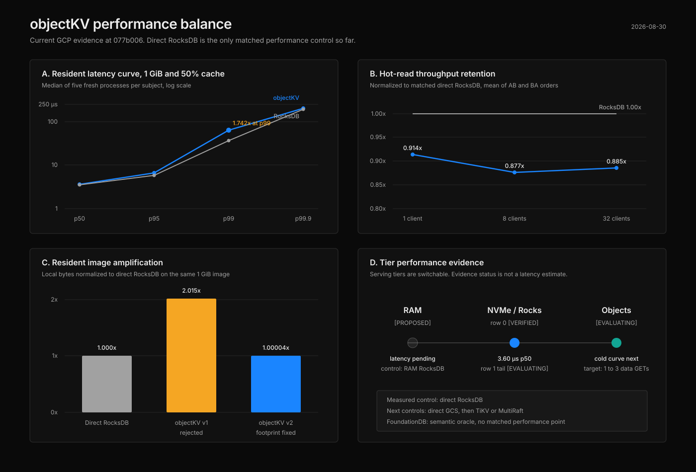

# RFC-0047 provider-v2 physical preflight and tail diagnostic

Status: `[VERIFIED]` V2.1 local-footprint preflight. `[EVALUATING]` V2.2 tail
latency. The 1 GiB replay was intentionally stopped after ten complete fresh
processes, five native and five direct RocksDB, when the program chose to defer
the p99 investigation and activate matrix row 2.

## Program call

Provider v2 fixed the diagnosed physical-layout defect. Native local bytes are
1.000037x direct RocksDB on the 1 GiB image, down from provider v1's 2.015239x.
The bounded replay does not admit the complete cache-pressure curve, but it
shows a localized tail defect rather than broad resident-path overhead:

- p50: 1.026x control;
- p95: 1.131x control;
- p99: 1.742x control;
- p99.9: 1.032x control.

The p99 discontinuity remains a real open issue. The current inference is that
it sits near the cache-hit to cache-miss boundary because the surrounding
percentiles are much closer to control. The run did not instrument individual
latencies by cache hit or miss, so that explanation is not verified.

Decision: keep matrix row 1 `[EVALUATING]`, preserve this diagnostic, and move
the active evaluation frontier to cold indexed reads from GCS. A later row-1
slice will add cache-hit and cache-miss attribution before changing the engine
or the frozen 1.20x p99 admission limit.

## Four views of current balance



Only direct RocksDB has a matched performance measurement in this figure.
RAM-backed RocksDB, direct indexed GCS, TiKV or MultiRaft, and FoundationDB are
named as the next controls, not plotted as fabricated observations.

## Combined percentile curve

Median of five fresh-process observations per subject. Latency is in
microseconds.

| Percentile | objectKV native v2 | Direct RocksDB | Native / control |
|---:|---:|---:|---:|
| p50 | 3.604 | 3.514 | 1.0256x |
| p95 | 6.633 | 5.865 | 1.1309x |
| p99 | 64.574 | 37.074 | 1.7418x |
| p99.9 | 200.734 | 194.491 | 1.0321x |

The evaluator did not emit p90 for this run. That remains an instrumentation
gap, not a value inferred from neighboring percentiles.

## Scope and identity

```text
source revision          077b0062e5877b12c007b7efeeb7726f51006964
source archive sha256    3f57947b171048aa9501f00b70f39b199787d6d8465d94a5c3760a426bdfd53c
release binary sha256    9e10bed490b3fa0837abbe732dcb8708ad334a596c3b34588c9cc6c16fa0c802
machine receipt sha256   f81ca98e310153b423ff539b00aade8cce2357d12d4737afe29492e58b85b834
V2.1 plan sha256         e60b899c4febfe4f56e14daae23befe0316a894ff7ada4344b9a5b5654a7ab14
V2.1 run receipt sha256  ca92d5711708b6b146a92e48992dd8df2b7811a368a7273565faa97bf9ae8768
V2.1 OTel run id         d2049e6c-6548-488c-98ee-a53351005be2
1 GiB plan sha256        29609ab311a1c28a8459e9c0c8b78ffd471054045e24a9069d5940065fbd4c28
partial positions        10 complete, 5 per subject
partial digest list      a868deea28e71680b3cc0cc3be63a0186d6ab9f5ce24ea7c89ee0a9f1e6194ac
```

The exact release build passed 122 library tests and three controller tests.
The V2.1 preflight passed all semantic, pressure, local-byte, runtime, and OTel
gates. Its native local-byte ratio was 1.000703x at 64 MiB. The partial 1 GiB
diagnostic produced no complete-stratum receipt and cannot be combined with
provider-v1 samples for admission.

## Durable evidence

```text
source
  gs://doss-objectkv-dev-okv-evals/runs/rfc0047-resident-v2-20260830/source/objectkv-077b006-canonical.tar.gz
  generation 1788064498299168

preflight plus partial diagnostic
  gs://doss-objectkv-dev-okv-evals/runs/rfc0047-resident-v2-20260830/evidence/rfc0047-v2-preflight-tail-diagnostic-077b006.tgz
  generation 1788067287107105
  sha256 c83fcc25f42d994d9640cc2761f42cf8e83c4b1d541e2523b8d6515457fa7e62
```

The in-progress 1.1 GiB scratch image was deleted after the intentional stop.
The ten position receipts and reports remain in the durable evidence bundle.
